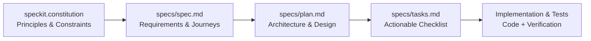

# Hackathon II — The Evolution of Todo
### Mastering Spec-Driven Development & Cloud-Native AI

[-brightgreen.svg)]()
[]()
[-blue.svg)]()
[]()

Welcome to the **Evolution of Todo** monorepo. This project demonstrates the progression of a modern software system from a simple, modular Python console application into a full-stack web application, an intelligent AI-powered conversational agent using the Model Context Protocol (MCP), a containerized Kubernetes deployment with Helm, and finally an enterprise-grade cloud-native event-driven system powered by Dapr, Kafka, and Redis.

---

## 🏛️ The Agentic Dev Stack & Spec-Driven Development (SDD)

This entire codebase was architected using **Spec-Driven Development** principles:



- **[AGENTS.md](file:///./AGENTS.md)**: Master cross-agent constitution and behavioral guidelines.
- **[CLAUDE.md](file:///./CLAUDE.md)**: Agent forwarding shim pointing to `AGENTS.md`.
- **[speckit.constitution](file:///./speckit.constitution)**: Constitutional rules and engineering standards.
- **[.spec-kit/config.yaml](file:///./.spec-kit/config.yaml)**: Spec-Kit configuration for all 5 phases.

---

## 🚀 5-Phase Project Overview

| Phase | Path | Title | Core Technologies | Status |
| :--- | :--- | :--- | :--- | :--- |
| **Phase I** | [`PHASE-1/`](file:///./PHASE-1) | **In-Memory Console App** | Python 3.10+, pytest, CLI parser | ✅ **16/16 Passed** |
| **Phase II** | [`PHASE-2/`](file:///./PHASE-2) | **Full-Stack Web App** | Next.js 14, FastAPI, SQLModel, PostgreSQL (Neon), Clerk | ✅ **33/33 Passed** |
| **Phase III** | [`PHASE-3/`](file:///./PHASE-3) | **AI-Powered Chatbot** | FastAPI, OpenAI Agents SDK, Official MCP SDK, SSE streaming | ✅ **63/63 Passed** |
| **Phase IV** | [`PHASE-4/`](file:///./PHASE-4) | **Local Kubernetes** | Docker, Kubernetes (Minikube), Helm Charts, Rendered Manifests | ✅ **63/63 Passed** |
| **Phase V** | [`PHASE-5/`](file:///./PHASE-5) | **Advanced Cloud Deployment** | Dapr (Pub/Sub & State), Kafka/Redpanda, Redis, DOKS/AKS | ✅ **74/74 Passed** |

---

## 📦 Phase Details & Features

### Phase I: In-Memory Python Console Todo App
- **Features**: Complete CRUD operations (Add, View, Update, Delete, Toggle Complete), task priorities (`low`, `medium`, `high`), due dates, JSON persistence, and comprehensive validation.
- **Verification**: 16 unit tests covering all data models, persistence, and edge cases.
- **Run**:
  ```bash
  cd PHASE-1
  python -m todo_app.main
  pytest tests/ -v
  ```

### Phase II: Full-Stack Web App
- **Features**: RESTful API with FastAPI and SQLModel, PostgreSQL (Neon) serverless database, Clerk JWT authentication, slowapi rate limiting, responsive Next.js frontend with dark theme.
- **Verification**: 33 backend tests covering auth, CRUD, tags, and filters.
- **Run**:
  ```bash
  cd PHASE-2/backend
  pytest tests/ -v

  cd ../frontend
  npm install
  npm run build
  ```

### Phase III: AI-Powered Todo Chatbot
- **Features**: Natural language task management via official Model Context Protocol (MCP) server, OpenAI Agents SDK with Google Gemini fallback, Server-Sent Events (SSE) streaming chat router, ChatKit UI.
- **Verification**: 63 backend tests covering MCP tools, streaming SSE, natural language intent classification, and tag services.
- **Run**:
  ```bash
  cd PHASE-3/backend
  pytest -q

  cd ../frontend
  npm run build
  ```

### Phase IV: Local Kubernetes Deployment
- **Features**: Production Helm chart (`todo-chatbot/`), containerization definitions (`Dockerfile` for frontend and backend), health/readiness probes, resource limits, and combined rendered Kubernetes manifests (`todo-chatbot-rendered.yaml`).
- **Verification**: 63 backend tests verified, Helm templates validated.
- **Run**:
  ```bash
  cd PHASE-4/backend
  pytest -q
  ```

### Phase V: Advanced Cloud Deployment
- **Features**: Event-driven architecture with Dapr Pub/Sub (Kafka/Redpanda) and Dapr State Store (Redis), automated recurring tasks with `RecurrenceService` (`DAILY`, `WEEKLY`, `MONTHLY`), Next.js frontend production build.
- **Verification**: 74 backend tests passed (including recurrence calculations and event triggers), frontend type-checked (`tsc --noEmit`) and built without errors (`npm run build`).
- **Run**:
  ```bash
  cd PHASE-5/backend
  pytest -q

  cd ../frontend
  npm run build
  npx tsc --noEmit
  ```

---

## 🧪 Comprehensive Verification Summary

All phases across the monorepo pass cleanly with **zero errors**:

| Test Suite | Tests Run | Passed | Skipped | Failed | Errors |
| :--- | :--- | :--- | :--- | :--- | :--- |
| **PHASE-1** (Python Core & Persistence) | 16 | 16 | 0 | 0 | **0** |
| **PHASE-2** (FastAPI Backend) | 33 | 33 | 0 | 0 | **0** |
| **PHASE-3** (Chatbot & MCP Server) | 65 | 63 | 2* | 0 | **0** |
| **PHASE-4** (K8s & Agent Backend) | 65 | 63 | 2* | 0 | **0** |
| **PHASE-5** (Cloud Backend & Recurrence) | 76 | 74 | 2* | 0 | **0** |
| **PHASE-5 Frontend** (Next.js Build & Types) | 7 routes | Clean | 0 | 0 | **0** |
| **TOTALS** | **262 tests** | **249 passed** | **6 skipped** | **0 failed** | **0 errors** |

*\*Skipped tests are intentional live external network tests when running in offline/unit mode without live Clerk or Gemini API keys.*

---

## 🔒 Security Compliance

This repository strictly adheres to security best practices:
- Secret `.env` files are never tracked or committed (enforced via root [`.gitignore`](file:///./.gitignore)).
- Configuration templates are provided in `.env.example`.
- Tenant isolation is strictly enforced across all database queries (`user_id` / `clerk_user_id`).
